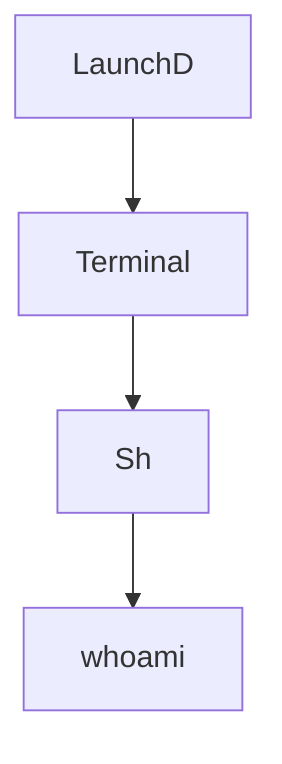

# macOS-Threat-Hunting-
Welcome to the macOS Threat Hunting GitHub repository! This repository serves as a centralized hub for resources, tools, and techniques related to threat hunting on macOS systems.This GitHub is still being developed. Here are a few general macOS threat hunting resources. I'll regularly add new techniques. Your contribution is also greatly appreciated. 

**Threat Hunting Resources**

Genernal macOS security news
https://macsecurity.net/news 

**macOS threat hunting blogs by the themittenmac**
https://themittenmac.com/blog/

**Process Tree**

Every other process on a macOS machine is a child of LaunchD, which is the first process to run when the machine boots.

**Users**
| Users ID | Description |
| --- | --- |
| 0 | List all new or modified files |
| 500 | Show file differences that haven't been staged |
| 501 | Show file differences that haven't been staged |
